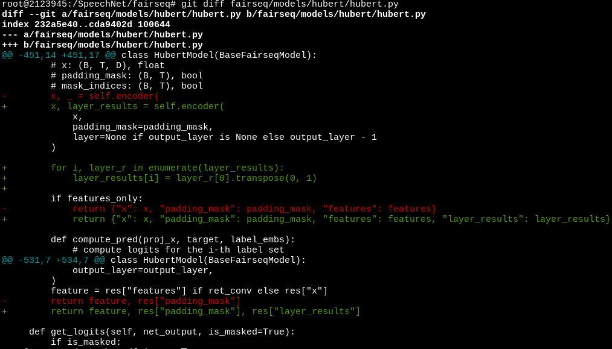
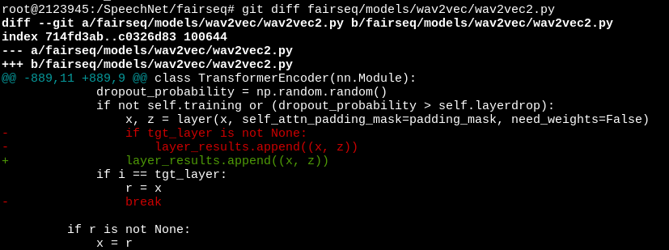

# Implementation of "SPEECH REPRESENTATION LEARNING THROUGH SELF-SUPERVISED PRETRAINING AND MULTI-TASK FINETUNING"

## Requirements

Please install as the [branch master](https://github.com/s3prl/s3prl/tree/master).

To enable using weighted sum of hidden states of all layers in HuBERT as the
representations, we modify the code in fairseq as the following:

And run `pip3 install -e .` under the path of fairseq directory.

## Usage 

To reproduce the results of the paper, please refer to [run_multitask.sh](https://github.com/s3prl/s3prl/blob/multi-task-distributed/run_multitask.sh), [multitask.yaml](https://github.com/s3prl/s3prl/blob/multi-task-distributed/downstream/multitask.yaml) and the paper for more details.
