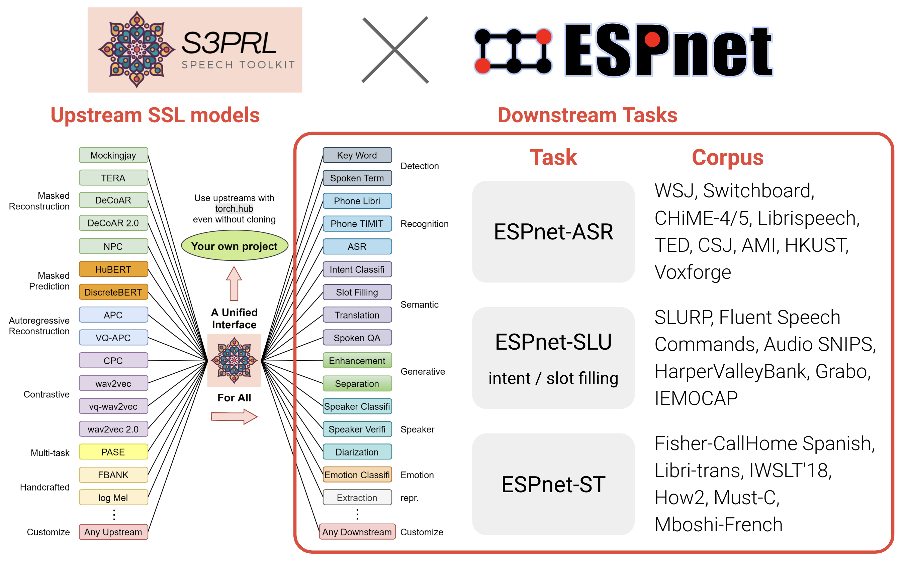

<p align="center">
    
    <br>
    <br>
    <a href="./LICENSE.txt"></a>
    <a href="https://creativecommons.org/licenses/by-nc/4.0/"></a>
    <a href="https://github.com/s3prl/s3prl/actions/workflows/ci.yml"></a>
    <a href="#development-pattern-for-contributors"></a>
    <a href="https://github.com/s3prl/s3prl/issues"></a>
</p>

## Contact

We prefer to have discussions directly on Github issue page, so that all the information is transparent to all the contributors and is auto-archived on the Github.
If you wish to use email, please contact:

- [Shu-wen (Leo) Yang](https://leo19941227.github.io/) (leo19941227@gmail.com)
- [Andy T. Liu](https://andi611.github.io/) (liuandyt@gmail.com)

Please refer to the [legacy citation](https://scholar.google.com/citations?view_op=view_citation&hl=en&user=R1mNI8QAAAAJ&citation_for_view=R1mNI8QAAAAJ:LkGwnXOMwfcC) of S3PRL and the timeline below, which justify our initiative on this project. This information is used to protect us from half-truths. We encourage to cite the individual papers most related to the function you are using to give fair credit to the developer of the function. You can find the names in the [Change Log](#change-log). Finally, we would like to thank our advisor, [Prof. Hung-yi Lee](https://speech.ee.ntu.edu.tw/~hylee/index.php), for his advice. The project would be impossible without his support.

If you have any question (e.g., about who came up with / developed which ideas / functions or how the project started), feel free to engage in an open and responsible conversation on the GitHub issue page, and we'll be happy to help!

## Contribution (pull request)

**Guideline**

- Starting in 2024, we will only accept new contributions in the form of new upstream models, so we can save bandwidth for developing new techniques (which will not be in S3PRL.)
- S3PRL has transitioned into pure maintenance mode, ensuring the long-term maintenance of all existing functions.
- Reporting bugs or the PR fixing the bugs is always welcome! Thanks!

**Tutorials**

- [General tutorial](https://s3prl.github.io/s3prl/contribute/general.html)
- [Tutorial for adding new upstream models](https://s3prl.github.io/s3prl/contribute/upstream.html)

## Environment compatibilities [](https://github.com/s3prl/s3prl/actions/workflows/ci.yml)

We support the following environments. The test cases are ran with **[tox](./tox.ini)** locally and on **[github action](.github/workflows/ci.yml)**:

| Env | versions |
| --- | --- |
| os  | `ubuntu-18.04`, `ubuntu-20.04` |
| python | `3.7`, `3.8`, `3.9`, `3.10` |
| pytorch | `1.8.1`, `1.9.1`, `1.10.2`, `1.11.0`, `1.12.1` , `1.13.1` , `2.0.1` , `2.1.0` |

## Star History

[](https://star-history.com/#s3prl/s3prl&Date)

## Change Log

> We only list the major contributors here for conciseness. However, we are deeply grateful for all the contributions. Please see the [Contributors](https://github.com/s3prl/s3prl/graphs/contributors) page for the full list.

* *Dec 2023*: Support Multi-resolution HuBERT (MR-HuBERT, see [Multiresolution HuBERT](https://arxiv.org/pdf/2310.02720.pdf))
* *Oct 2023*: Support ESPnet pre-trained upstream models (see [ESPnet HuBERT](https://arxiv.org/abs/2306.06672) and [WavLabLM](https://arxiv.org/abs/2309.15317))
* *Sep 2022*: In [JSALT 2022](https://jsalt-2022-ssl.github.io/member), We upgrade the codebase to support testing, documentation and a new [S3PRL PyPI package](https://pypi.org/project/s3prl/) for easy installation and usage for upstream models. See our [online doc](https://s3prl.github.io/s3prl/) for more information. The package is now used by many [open-source projects](https://github.com/s3prl/s3prl/network/dependents), including [ESPNet](https://github.com/espnet/espnet/blob/master/espnet2/asr/frontend/s3prl.py). Contributors: [Shu-wen Yang](https://leo19941227.github.io/) ***(NTU)***, [Andy T. Liu](https://andi611.github.io/) ***(NTU)***, [Heng-Jui Chang](https://people.csail.mit.edu/hengjui/) ***(MIT)***, [Haibin Wu](https://hbwu-ntu.github.io/) ***(NTU)*** and [Xuankai Chang](https://www.xuankaic.com/) ***(CMU)***.
* *Mar 2022*: Introduce [**SUPERB-SG**](https://arxiv.org/abs/2203.06849), see [Speech Translation](./s3prl/downstream/speech_translation) by [Hsiang-Sheng Tsai](https://github.com/bearhsiang) ***(NTU)***, [Out-of-domain ASR](./s3prl/downstream/ctc/) by [Heng-Jui Chang](https://people.csail.mit.edu/hengjui/) ***(NTU)***, [Voice Conversion](./s3prl/downstream/a2o-vc-vcc2020/) by [Wen-Chin Huang](https://unilight.github.io/) ***(Nagoya)***, [Speech Separation](./s3prl/downstream/separation_stft/) and [Speech Enhancement](./s3prl/downstream/enhancement_stft/) by [Zili Huang](https://scholar.google.com/citations?user=iQ-S0fQAAAAJ&hl=en) ***(JHU)*** for more info.
* *Mar 2022*: Introduce [**SSL for SE/SS**](https://arxiv.org/abs/2203.07960) by [Zili Huang](https://scholar.google.com/citations?user=iQ-S0fQAAAAJ&hl=en) ***(JHU)***. See [SE1](https://github.com/s3prl/s3prl/tree/main/s3prl/downstream/enhancement_stft) and [SS1](https://github.com/s3prl/s3prl/tree/main/s3prl/downstream/separation_stft) folders for more details. Note that the improved performances can be achieved by the later introduced [SE2](https://github.com/s3prl/s3prl/tree/main/s3prl/downstream/enhancement_stft2) and [SS2](https://github.com/s3prl/s3prl/tree/main/s3prl/downstream/separation_stft2). However, for aligning with [SUPERB-SG](https://arxiv.org/abs/2203.06849) benchmarking, please use the version 1.
* *Nov 2021*: Introduce [**S3PRL-VC**](https://arxiv.org/abs/2110.06280) by [Wen-Chin Huang](https://unilight.github.io/) ***(Nagoya)***, see [Any-to-one](https://github.com/s3prl/s3prl/tree/master/s3prl/downstream/a2o-vc-vcc2020) for more info. We highly recommend to consider the [newly released official repo of S3PRL-VC](https://github.com/unilight/s3prl-vc) which is developed and actively maintained by [Wen-Chin Huang](https://unilight.github.io/). The standalone repo contains much more recepies for the VC experiments. In S3PRL we only include the Any-to-one recipe for reproducing the SUPERB results.
* *Oct 2021*: Support [**DistilHuBERT**](https://arxiv.org/abs/2110.01900) by [Heng-Jui Chang](https://people.csail.mit.edu/hengjui/) ***(NTU)***, see [docs](./s3prl/upstream/distiller/README.md) for more info.
* *Sep 2021:* We host a *challenge* in [*AAAI workshop: The 2nd Self-supervised Learning for Audio and Speech Processing*](https://aaai-sas-2022.github.io/)! See [**SUPERB official site**](https://superbbenchmark.org/) for the challenge details and the [**SUPERB documentation**](./s3prl/downstream/docs/superb.md) in this toolkit!
* *Aug 2021:* [Andy T. Liu](https://andi611.github.io/) ***(NTU)*** and [Shu-wen Yang](https://leo19941227.github.io/) ***(NTU)*** introduces the S3PRL toolkit in [MLSS 2021](https://ai.ntu.edu.tw/%e7%b7%9a%e4%b8%8a%e5%ad%b8%e7%bf%92-2/mlss-2021/), you can also **[watch it on Youtube](https://youtu.be/PkMFnS6cjAc)**!
* *Aug 2021:* [**TERA**](https://ieeexplore.ieee.org/document/9478264) by [Andy T. Liu](https://andi611.github.io/) ***(NTU)*** is accepted to TASLP!
* *July 2021:* We are now working on packaging s3prl and reorganizing the file structure in **v0.3**. Please consider using the stable **v0.2.0** for now. We will test and release **v0.3** before August.
* *June 2021:* Support [**SUPERB:** **S**peech processing **U**niversal **PER**formance **B**enchmark](https://arxiv.org/abs/2105.01051), submitted to Interspeech 2021. Use the tag **superb-interspeech2021** or **v0.2.0**. Contributors: [Shu-wen Yang](https://leo19941227.github.io/) ***(NTU)***, [Pohan Chi](https://scholar.google.com/citations?user=SiyicoEAAAAJ&hl=zh-TW) ***(NTU)***, [Yist Lin](https://scholar.google.com/citations?user=0lrZq9MAAAAJ&hl=en) ***(NTU)***, [Yung-Sung Chuang](https://scholar.google.com/citations?user=3ar1DOwAAAAJ&hl=zh-TW) ***(NTU)***, [Jiatong Shi](https://scholar.google.com/citations?user=FEDNbgkAAAAJ&hl=en) ***(CMU)***, [Xuankai Chang](https://www.xuankaic.com/) ***(CMU)***, [Wei-Cheng Tseng](https://scholar.google.com.tw/citations?user=-d6aNP0AAAAJ&hl=zh-TW) ***(NTU)***, Tzu-Hsien Huang ***(NTU)*** and [Kushal Lakhotia](https://scholar.google.com/citations?user=w9W6zXUAAAAJ&hl=en) ***(Meta)***.
* *June 2021:* Support extracting multiple hidden states for all the SSL pretrained models by [Shu-wen Yang](https://leo19941227.github.io/) ***(NTU)***.
* *Jan 2021:* Readme updated with detailed instructions on how to use our latest version!
* *Dec 2020:* We are migrating to a newer version for a more general, flexible, and scalable code. See the introduction below for more information! The legacy version can be accessed the tag **v0.1.0**.
* *Oct 2020:* [Shu-wen Yang](https://leo19941227.github.io/) ***(NTU)*** and [Andy T. Liu](https://andi611.github.io/) ***(NTU)*** added varioius classic upstream models, including PASE+, APC, VQ-APC, NPC, wav2vec, vq-wav2vec ...etc.
* *Oct 2019:* The birth of S3PRL! The repository was created for the [**Mockingjay**](https://arxiv.org/abs/1910.12638) development. [Andy T. Liu](https://andi611.github.io/) ***(NTU)***, [Shu-wen Yang](https://leo19941227.github.io/) ***(NTU)*** and [Pohan Chi](https://scholar.google.com/citations?user=SiyicoEAAAAJ&hl=zh-TW) ***(NTU)*** implemented the pre-training scripts and several simple downstream evaluation tasks. This work was the very start of the S3PRL project which established lots of foundamental modules and coding styles. Feel free to checkout to the old commits to explore our [legacy codebase](https://github.com/s3prl/s3prl/tree/6a53ee92bffeaa75fc2fb56071050bcf71e93785)!

****

## Introduction and Usages

This is an open source toolkit called **s3prl**, which stands for **S**elf-**S**upervised **S**peech **P**re-training and **R**epresentation **L**earning.
Self-supervised speech pre-trained models are called **upstream** in this toolkit, and are utilized in various **downstream** tasks.

The toolkit has **three major usages**:

### Pretrain

- Pretrain upstream models, including Mockingjay, Audio ALBERT and TERA.
- Document: [**pretrain/README.md**](./s3prl/pretrain/README.md)

### Upstream

- Easily load most of the existing upstream models with pretrained weights in a unified I/O interface.
- Pretrained models are registered through **torch.hub**, which means you can use these models in your own project by one-line plug-and-play without depending on this toolkit's coding style.
- Document: [**upstream/README.md**](./s3prl/upstream/README.md)

### Downstream

- Utilize upstream models in lots of downstream tasks
- Benchmark upstream models with [**SUPERB Benchmark**](./s3prl/downstream/docs/superb.md)
- Document: [**downstream/README.md**](./s3prl/downstream/README.md)

---

Here is a high-level illustration of how S3PRL might help you. We support to leverage numerous SSL representations on numerous speech processing tasks in our [GitHub codebase](https://github.com/s3prl/s3prl):


---

We also modularize all the SSL models into a standalone [PyPi package](https://pypi.org/project/s3prl/) so that you can easily install it and use it without depending on our entire codebase. The following shows a simple example and you can find more details in our [documentation](https://s3prl.github.io/s3prl/).

1. Install the S3PRL package:

```sh
pip install s3prl
```

2. Use it to extract representations for your own audio:

```python
import torch
from s3prl.nn import S3PRLUpstream

model = S3PRLUpstream("hubert")
model.eval()

with torch.no_grad():
    wavs = torch.randn(2, 16000 * 2)
    wavs_len = torch.LongTensor([16000 * 1, 16000 * 2])
    all_hs, all_hs_len = model(wavs, wavs_len)

for hs, hs_len in zip(all_hs, all_hs_len):
    assert isinstance(hs, torch.FloatTensor)
    assert isinstance(hs_len, torch.LongTensor)

    batch_size, max_seq_len, hidden_size = hs.shape
    assert hs_len.dim() == 1
```

---

With this modularization, we have achieved close integration with the general speech processing toolkit [ESPNet](https://github.com/espnet/espnet), enabling the use of SSL models for a broader range of speech processing tasks and corpora to achieve state-of-the-art (SOTA) results (kudos to the [ESPNet Team](https://www.wavlab.org/open_source)):



You can start the journey of SSL with the following entry points:

- S3PRL: [A simple SUPERB downstream task](https://github.com/s3prl/s3prl/blob/main/s3prl/downstream/docs/superb.md#pr-phoneme-recognition)
- ESPNet: [Levearging S3PRL for ASR](https://github.com/espnet/espnet/tree/master/egs2/librispeech/asr1#self-supervised-learning-features-hubert_large_ll60k-conformer-utt_mvn-with-transformer-lm)

---

Feel free to use or modify our toolkit in your research. Here is a [list of papers using our toolkit](#used-by). Any question, bug report or improvement suggestion is welcome through [opening up a new issue](https://github.com/s3prl/s3prl/issues).

If you find this toolkit helpful to your research, please do consider citing [our papers](#citation), thanks!

## Installation

1. **Python** >= 3.6
2. Install **sox** on your OS
3. Install s3prl: [Read doc](https://s3prl.github.io/s3prl/tutorial/installation.html#) or `pip install -e ".[all]"`
4. (Optional) Some upstream models require special dependencies. If you encounter error with a specific upstream model, you can look into the `README.md` under each `upstream` folder. E.g., `upstream/pase/README.md`=

## Reference Repositories

* [Pytorch](https://github.com/pytorch/pytorch), Pytorch.
* [Audio](https://github.com/pytorch/audio), Pytorch.
* [Kaldi](https://github.com/kaldi-asr/kaldi), Kaldi-ASR.
* [Transformers](https://github.com/huggingface/transformers), Hugging Face.
* [PyTorch-Kaldi](https://github.com/mravanelli/pytorch-kaldi), Mirco Ravanelli.
* [fairseq](https://github.com/pytorch/fairseq), Facebook AI Research.
* [CPC](https://github.com/facebookresearch/CPC_audio), Facebook AI Research.
* [APC](https://github.com/iamyuanchung/Autoregressive-Predictive-Coding), Yu-An Chung.
* [VQ-APC](https://github.com/s3prl/VQ-APC), Yu-An Chung.
* [NPC](https://github.com/Alexander-H-Liu/NPC), Alexander-H-Liu.
* [End-to-end-ASR-Pytorch](https://github.com/Alexander-H-Liu/End-to-end-ASR-Pytorch), Alexander-H-Liu
* [Mockingjay](https://github.com/andi611/Mockingjay-Speech-Representation), Andy T. Liu.
* [ESPnet](https://github.com/espnet/espnet), Shinji Watanabe
* [speech-representations](https://github.com/awslabs/speech-representations), aws lab
* [PASE](https://github.com/santi-pdp/pase), Santiago Pascual and Mirco Ravanelli
* [LibriMix](https://github.com/JorisCos/LibriMix), Joris Cosentino and Manuel Pariente

## License

The majority of S3PRL Toolkit is licensed under the Apache License version 2.0, however all the files authored by Facebook, Inc. (which have explicit copyright statement on the top) are licensed under CC-BY-NC.

## Used by
<details><summary>List of papers that used our toolkit (Feel free to add your own paper by making a pull request)</summary><p>

### Self-Supervised Pretraining

+ [Mockingjay: Unsupervised Speech Representation Learning with Deep Bidirectional Transformer Encoders (Liu et al., 2020)](https://arxiv.org/abs/1910.12638)
  ```
  @article{mockingjay,
     title={Mockingjay: Unsupervised Speech Representation Learning with Deep Bidirectional Transformer Encoders},
     ISBN={9781509066315},
     url={http://dx.doi.org/10.1109/ICASSP40776.2020.9054458},
     DOI={10.1109/icassp40776.2020.9054458},
     journal={ICASSP 2020 - 2020 IEEE International Conference on Acoustics, Speech and Signal Processing (ICASSP)},
     publisher={IEEE},
     author={Liu, Andy T. and Yang, Shu-wen and Chi, Po-Han and Hsu, Po-chun and Lee, Hung-yi},
     year={2020},
     month={May}
  }
  ```
+ [TERA: Self-Supervised Learning of Transformer Encoder Representation for Speech (Liu et al., 2020)](https://arxiv.org/abs/2007.06028)
  ```
  @misc{tera,
      title={TERA: Self-Supervised Learning of Transformer Encoder Representation for Speech},
      author={Andy T. Liu and Shang-Wen Li and Hung-yi Lee},
      year={2020},
      eprint={2007.06028},
      archivePrefix={arXiv},
      primaryClass={eess.AS}
  }
  ```
+ [Audio ALBERT: A Lite BERT for Self-supervised Learning of Audio Representation (Chi et al., 2020)](https://arxiv.org/abs/2005.08575)
  ```
  @inproceedings{audio_albert,
      title={Audio ALBERT: A Lite BERT for Self-supervised Learning of Audio Representation},
      author={Po-Han Chi and Pei-Hung Chung and Tsung-Han Wu and Chun-Cheng Hsieh and Shang-Wen Li and Hung-yi Lee},
      year={2020},
      booktitle={SLT 2020},
  }
  ```

### Explanability

+ [Understanding Self-Attention of Self-Supervised Audio Transformers (Yang et al., 2020)](https://arxiv.org/abs/2006.03265)
  ```
  @inproceedings{understanding_sat,
      author={Shu-wen Yang and Andy T. Liu and Hung-yi Lee},
      title={{Understanding Self-Attention of Self-Supervised Audio Transformers}},
      year=2020,
      booktitle={Proc. Interspeech 2020},
      pages={3785--3789},
      doi={10.21437/Interspeech.2020-2231},
      url={http://dx.doi.org/10.21437/Interspeech.2020-2231}
  }
  ```

### Adversarial Attack

+ [Defense for Black-box Attacks on Anti-spoofing Models by Self-Supervised Learning (Wu et al., 2020)](https://arxiv.org/abs/2006.03214), code for computing LNSR: [utility/observe_lnsr.py](https://github.com/s3prl/s3prl/blob/master/utility/observe_lnsr.py)
  ```
  @inproceedings{mockingjay_defense,
      author={Haibin Wu and Andy T. Liu and Hung-yi Lee},
      title={{Defense for Black-Box Attacks on Anti-Spoofing Models by Self-Supervised Learning}},
      year=2020,
      booktitle={Proc. Interspeech 2020},
      pages={3780--3784},
      doi={10.21437/Interspeech.2020-2026},
      url={http://dx.doi.org/10.21437/Interspeech.2020-2026}
  }
  ```

+ [Adversarial Defense for Automatic Speaker Verification by Cascaded Self-Supervised Learning Models (Wu et al., 2021)](https://arxiv.org/abs/2102.07047)
  ```
  @misc{asv_ssl,
      title={Adversarial defense for automatic speaker verification by cascaded self-supervised learning models},
      author={Haibin Wu and Xu Li and Andy T. Liu and Zhiyong Wu and Helen Meng and Hung-yi Lee},
      year={2021},
      eprint={2102.07047},
      archivePrefix={arXiv},
      primaryClass={eess.AS}
  ```

### Voice Conversion

+ [S2VC: A Framework for Any-to-Any Voice Conversion with Self-Supervised Pretrained Representations (Lin et al., 2021)](https://arxiv.org/abs/2104.02901)
  ```
  @misc{s2vc,
        title={S2VC: A Framework for Any-to-Any Voice Conversion with Self-Supervised Pretrained Representations},
        author={Jheng-hao Lin and Yist Y. Lin and Chung-Ming Chien and Hung-yi Lee},
        year={2021},
        eprint={2104.02901},
        archivePrefix={arXiv},
        primaryClass={eess.AS}
  }
  ```

### Benchmark and Evaluation

+ [SUPERB: Speech processing Universal PERformance Benchmark (Yang et al., 2021)](https://arxiv.org/abs/2105.01051)
  ```
  @misc{superb,
        title={SUPERB: Speech processing Universal PERformance Benchmark},
        author={Shu-wen Yang and Po-Han Chi and Yung-Sung Chuang and Cheng-I Jeff Lai and Kushal Lakhotia and Yist Y. Lin and Andy T. Liu and Jiatong Shi and Xuankai Chang and Guan-Ting Lin and Tzu-Hsien Huang and Wei-Cheng Tseng and Ko-tik Lee and Da-Rong Liu and Zili Huang and Shuyan Dong and Shang-Wen Li and Shinji Watanabe and Abdelrahman Mohamed and Hung-yi Lee},
        year={2021},
        eprint={2105.01051},
        archivePrefix={arXiv},
        primaryClass={cs.CL}
  }
  ```

+ [Utilizing Self-supervised Representations for MOS Prediction (Tseng et al., 2021)](https://arxiv.org/abs/2104.03017)
  ```
  @misc{ssr_mos,
      title={Utilizing Self-supervised Representations for MOS Prediction},
      author={Wei-Cheng Tseng and Chien-yu Huang and Wei-Tsung Kao and Yist Y. Lin and Hung-yi Lee},
      year={2021},
      eprint={2104.03017},
      archivePrefix={arXiv},
      primaryClass={eess.AS}
  }
  ```
}

</p></details>

## Citation

If you find this toolkit useful, please consider citing following papers.

- If you use our pre-training scripts, or the downstream tasks considered in *TERA* and *Mockingjay*, please consider citing the following:
```
@misc{tera,
  title={TERA: Self-Supervised Learning of Transformer Encoder Representation for Speech},
  author={Andy T. Liu and Shang-Wen Li and Hung-yi Lee},
  year={2020},
  eprint={2007.06028},
  archivePrefix={arXiv},
  primaryClass={eess.AS}
}
```
```
@article{mockingjay,
   title={Mockingjay: Unsupervised Speech Representation Learning with Deep Bidirectional Transformer Encoders},
   ISBN={9781509066315},
   url={http://dx.doi.org/10.1109/ICASSP40776.2020.9054458},
   DOI={10.1109/icassp40776.2020.9054458},
   journal={ICASSP 2020 - 2020 IEEE International Conference on Acoustics, Speech and Signal Processing (ICASSP)},
   publisher={IEEE},
   author={Liu, Andy T. and Yang, Shu-wen and Chi, Po-Han and Hsu, Po-chun and Lee, Hung-yi},
   year={2020},
   month={May}
}
```

- If you use our organized upstream interface and features, or the *SUPERB* downstream benchmark, please consider citing the following:
```
@article{yang2024large,
  title={A Large-Scale Evaluation of Speech Foundation Models},
  author={Yang, Shu-wen and Chang, Heng-Jui and Huang, Zili and Liu, Andy T and Lai, Cheng-I and Wu, Haibin and Shi, Jiatong and Chang, Xuankai and Tsai, Hsiang-Sheng and Huang, Wen-Chin and others},
  journal={IEEE/ACM Transactions on Audio, Speech, and Language Processing},
  year={2024},
  publisher={IEEE}
}
```
```
@inproceedings{yang21c_interspeech,
  author={Shu-wen Yang and Po-Han Chi and Yung-Sung Chuang and Cheng-I Jeff Lai and Kushal Lakhotia and Yist Y. Lin and Andy T. Liu and Jiatong Shi and Xuankai Chang and Guan-Ting Lin and Tzu-Hsien Huang and Wei-Cheng Tseng and Ko-tik Lee and Da-Rong Liu and Zili Huang and Shuyan Dong and Shang-Wen Li and Shinji Watanabe and Abdelrahman Mohamed and Hung-yi Lee},
  title={{SUPERB: Speech Processing Universal PERformance Benchmark}},
  year=2021,
  booktitle={Proc. Interspeech 2021},
  pages={1194--1198},
  doi={10.21437/Interspeech.2021-1775}
}
```
