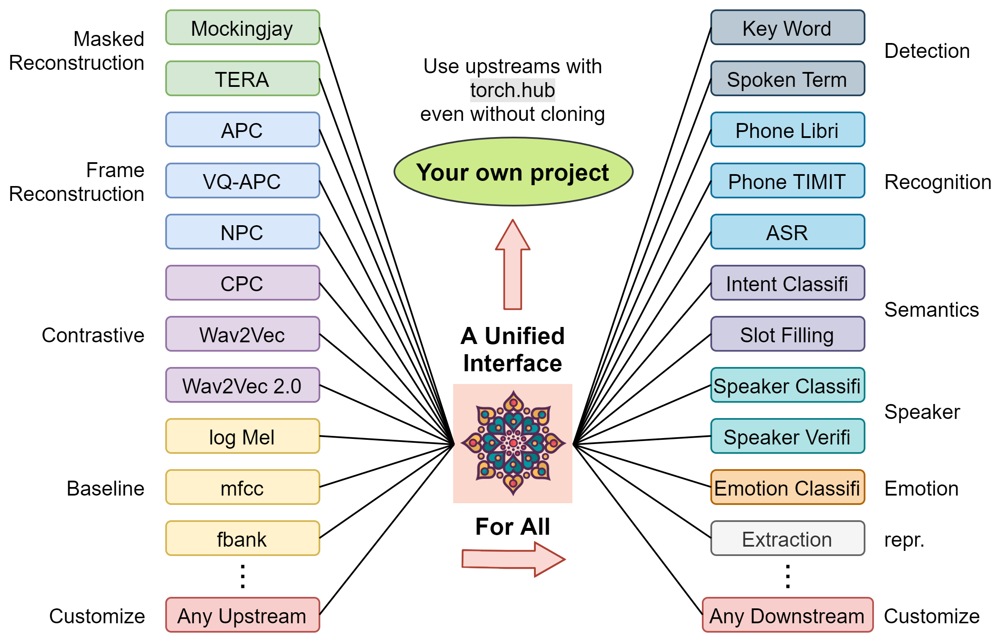

<p align="center">
    
    <br>
    <br>
    <a href="./LICENSE"></a>
    <a href="https://creativecommons.org/licenses/by-nc/4.0/"></a>
    <a href="https://github.com/s3prl/s3prl/actions"></a>
    <a href="#development-pattern-for-contributors"></a>
    <a href="https://github.com/s3prl/s3prl/issues"></a>
</p>

## What's New

* April 2021: Support [**SUPERB:** **S**peech processing **U**niversal **PER**formance **B**enchmark](https://arxiv.org/abs/2105.01051), submitted to Interspeech 2021
* Jan 2021: Readme updated with detailed instructions on how to use our latest version!
* Dec 2020: We are migrating to a newer version for a more general, flexible, and scalable code. See the introduction below for more information! The legacy verison can be accessed by checking out to the tag **v0.1.0**: `git checkout v0.1.0`.

## Introduction and Usages

This is an open source toolkit called **s3prl**, which stands for **S**elf-**S**upervised **S**peech **P**re-training and **R**epresentation **L**earning.
Self-supervised speech pre-trained models are called **upstream** in this toolkit, and are utilized in various **downstream** tasks.

The toolkit has **three major usages**:

### Pretrain
- Pretrain upstream models, including Mockingjay, Audio ALBERT and TERA.
- Document: [**pretrain/README.md**](./pretrain/README.md)

### Upstream
- Easily load most of the existing upstream models with pretrained weights in a unified I/O interface.
- Pretrained models are registered through **torch.hub**, which means you can use these models in your own project by one-line plug-and-play without depending on this toolkit's coding style.
- Document: [**upstream/README.md**](./upstream/README.md)

### Downstream
- Utilize upstream models in lots of downstream tasks
- Benchmark upstream models with [**SUPERB Benchmark**](https://arxiv.org/abs/2105.01051)
- Document: [**downstream/README.md**](./downstream/README.md)

Below is an **intuitive illustration** on how this toolkit may help you:
\
\

\
\
Feel free to use or modify our toolkit in your research. Here is a [list of papers using our toolkit](#used-by). Any questsion, bug report or improvement suggestion is welcome through [opening up a new issue](https://github.com/s3prl/s3prl/issues). 

If you find this toolkit helpful to your research, please do consider to cite [our papers](#citation), thanks!

## Installation

* **Python** >= 3.6
* Install **sox** on your OS
* Install generally used packages for *pretrain*, *upstream* and *downstream*:

```
git clone https://github.com/s3prl/s3prl.git
cd s3prl/
pip install -r requirements.txt
cd ../

git clone https://github.com/pytorch/fairseq.git
cd fairseq/
pip install -e ./
cd ../
```

* Some upstream models require special dependencies. If you encounter error with a specific upstream model, you can look into the `README.md` under each `upsream` folder. Eg. `upstream/pase/README.md`

## Development pattern for contributors

1. [Create a personal fork](https://help.github.com/articles/fork-a-repo/) of the [main S3PRL repository](https://github.com/andi611/Self-Supervised-Speech-Pretraining-and-Representation-Learning) in GitHub.
2. Make your changes in a named branch different from `master`, e.g. you create a branch `new-awesome-feature`.
3. Contact us if you have any questions during development.
4. [Generate a pull request](https://help.github.com/articles/creating-a-pull-request/) through the Web interface of GitHub.
5. Please verify that your code is free of basic mistakes, we appreciate any contribution!

## Reference Repositories

* [Pytorch](https://github.com/pytorch/pytorch), Pytorch.
* [Audio](https://github.com/pytorch/audio), Pytorch.
* [Kaldi](https://github.com/kaldi-asr/kaldi), Kaldi-ASR.
* [Transformers](https://github.com/huggingface/transformers), Hugging Face.
* [PyTorch-Kaldi](https://github.com/mravanelli/pytorch-kaldi), Mirco Ravanelli.
* [fairseq](https://github.com/pytorch/fairseq), Facebook AI Research.
* [CPC](https://github.com/facebookresearch/CPC_audio), Facebook AI Research.
* [APC](https://github.com/iamyuanchung/Autoregressive-Predictive-Coding), Yu-An Chung.
* [NPC](https://github.com/Alexander-H-Liu/NPC), Alexander-H-Liu.

## License

The majority of S3PRL Toolkit is licensed under CC-BY-NC, 
however portions of the project are available under separate license terms: S3PRL is licensed under the MIT license.

## Used by
<details><summary>List of papers that used our toolkit (Feel free to add your own paper by making a pull request)</summary><p>

### Self-Supervised Pretraining

+ [Mockingjay: Unsupervised Speech Representation Learning with Deep Bidirectional Transformer Encoders (Liu et al., 2020)](https://arxiv.org/abs/1910.12638)
  ```
  @article{mockingjay,
     title={Mockingjay: Unsupervised Speech Representation Learning with Deep Bidirectional Transformer Encoders},
     ISBN={9781509066315},
     url={http://dx.doi.org/10.1109/ICASSP40776.2020.9054458},
     DOI={10.1109/icassp40776.2020.9054458},
     journal={ICASSP 2020 - 2020 IEEE International Conference on Acoustics, Speech and Signal Processing (ICASSP)},
     publisher={IEEE},
     author={Liu, Andy T. and Yang, Shu-wen and Chi, Po-Han and Hsu, Po-chun and Lee, Hung-yi},
     year={2020},
     month={May}
  }
  ```
+ [TERA: Self-Supervised Learning of Transformer Encoder Representation for Speech (Liu et al., 2020)](https://arxiv.org/abs/2007.06028)
  ```
  @misc{tera,
      title={TERA: Self-Supervised Learning of Transformer Encoder Representation for Speech},
      author={Andy T. Liu and Shang-Wen Li and Hung-yi Lee},
      year={2020},
      eprint={2007.06028},
      archivePrefix={arXiv},
      primaryClass={eess.AS}
  }
  ```
+ [Audio ALBERT: A Lite BERT for Self-supervised Learning of Audio Representation (Chi et al., 2020)](https://arxiv.org/abs/2005.08575)
  ```
  @inproceedings{audio_albert,
      title={Audio ALBERT: A Lite BERT for Self-supervised Learning of Audio Representation},
      author={Po-Han Chi and Pei-Hung Chung and Tsung-Han Wu and Chun-Cheng Hsieh and Shang-Wen Li and Hung-yi Lee},
      year={2020},
      booktitle={SLT 2020},
  }
  ```

### Explanability

+ [Understanding Self-Attention of Self-Supervised Audio Transformers (Yang et al., 2020)](https://arxiv.org/abs/2006.03265)
  ```
  @inproceedings{understanding_sat,
      author={Shu-wen Yang and Andy T. Liu and Hung-yi Lee},
      title={{Understanding Self-Attention of Self-Supervised Audio Transformers}},
      year=2020,
      booktitle={Proc. Interspeech 2020},
      pages={3785--3789},
      doi={10.21437/Interspeech.2020-2231},
      url={http://dx.doi.org/10.21437/Interspeech.2020-2231}
  }
  ```

### Adversarial Attack

+ [Defense for Black-box Attacks on Anti-spoofing Models by Self-Supervised Learning (Wu et al., 2020)](https://arxiv.org/abs/2006.03214), code for computing LNSR: [utility/observe_lnsr.py](https://github.com/s3prl/s3prl/blob/master/utility/observe_lnsr.py)
  ```
  @inproceedings{mockingjay_defense,
      author={Haibin Wu and Andy T. Liu and Hung-yi Lee},
      title={{Defense for Black-Box Attacks on Anti-Spoofing Models by Self-Supervised Learning}},
      year=2020,
      booktitle={Proc. Interspeech 2020},
      pages={3780--3784},
      doi={10.21437/Interspeech.2020-2026},
      url={http://dx.doi.org/10.21437/Interspeech.2020-2026}
  }
  ```

+ [Adversarial Defense for Automatic Speaker Verification by Cascaded Self-Supervised Learning Models (Wu et al., 2021)](https://arxiv.org/abs/2102.07047)
  ```
  @misc{wu2021adversarial,
      title={Adversarial defense for automatic speaker verification by cascaded self-supervised learning models}, 
      author={Haibin Wu and Xu Li and Andy T. Liu and Zhiyong Wu and Helen Meng and Hung-yi Lee},
      year={2021},
      eprint={2102.07047},
      archivePrefix={arXiv},
      primaryClass={eess.AS}
  ```

### Voice Conversion

+ [S2VC: A Framework for Any-to-Any Voice Conversion with Self-Supervised Pretrained Representations (Lin et al., 2021)](https://arxiv.org/abs/2104.02901)
  ```
  @misc{lin2021s2vc,
        title={S2VC: A Framework for Any-to-Any Voice Conversion with Self-Supervised Pretrained Representations}, 
        author={Jheng-hao Lin and Yist Y. Lin and Chung-Ming Chien and Hung-yi Lee},
        year={2021},
        eprint={2104.02901},
        archivePrefix={arXiv},
        primaryClass={eess.AS}
  }
  ```

### Benchmark and Evaluation

+ [SUPERB: Speech processing Universal PERformance Benchmark (Yang et al., 2021)](https://arxiv.org/abs/2105.01051)
  ```
  @misc{yang2021superb,
        title={SUPERB: Speech processing Universal PERformance Benchmark}, 
        author={Shu-wen Yang and Po-Han Chi and Yung-Sung Chuang and Cheng-I Jeff Lai and Kushal Lakhotia and Yist Y. Lin and Andy T. Liu and Jiatong Shi and Xuankai Chang and Guan-Ting Lin and Tzu-Hsien Huang and Wei-Cheng Tseng and Ko-tik Lee and Da-Rong Liu and Zili Huang and Shuyan Dong and Shang-Wen Li and Shinji Watanabe and Abdelrahman Mohamed and Hung-yi Lee},
        year={2021},
        eprint={2105.01051},
        archivePrefix={arXiv},
        primaryClass={cs.CL}
  }
  ```

+ [Utilizing Self-supervised Representations for MOS Prediction (Tseng et al., 2021)](https://arxiv.org/abs/2104.03017)
  ```
  @misc{tseng2021utilizing,
      title={Utilizing Self-supervised Representations for MOS Prediction}, 
      author={Wei-Cheng Tseng and Chien-yu Huang and Wei-Tsung Kao and Yist Y. Lin and Hung-yi Lee},
      year={2021},
      eprint={2104.03017},
      archivePrefix={arXiv},
      primaryClass={eess.AS}
  }
  ```
}

</p></details>

## Citation

If you find our repository useful, please consider citing following papers.

```
@misc{tera,
  title={TERA: Self-Supervised Learning of Transformer Encoder Representation for Speech},
  author={Andy T. Liu and Shang-Wen Li and Hung-yi Lee},
  year={2020},
  eprint={2007.06028},
  archivePrefix={arXiv},
  primaryClass={eess.AS}
}
```
```
@misc{superb,
  title={SUPERB: Speech processing Universal PERformance Benchmark}, 
  author={Shu-wen Yang and Po-Han Chi and Yung-Sung Chuang and Cheng-I Jeff Lai and Kushal Lakhotia and Yist Y. Lin and Andy T. Liu and Jiatong Shi and Xuankai Chang and Guan-Ting Lin and Tzu-Hsien Huang and Wei-Cheng Tseng and Ko-tik Lee and Da-Rong Liu and Zili Huang and Shuyan Dong and Shang-Wen Li and Shinji Watanabe and Abdelrahman Mohamed and Hung-yi Lee},
  year={2021},
  eprint={2105.01051},
  archivePrefix={arXiv},
  primaryClass={cs.CL}
}
```
